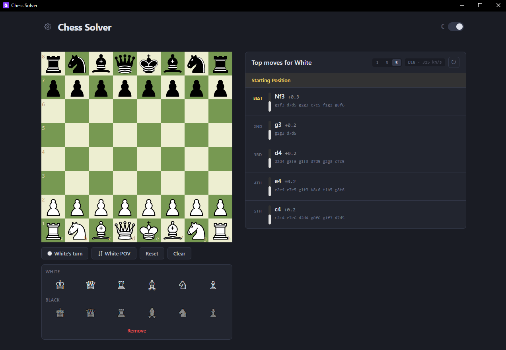
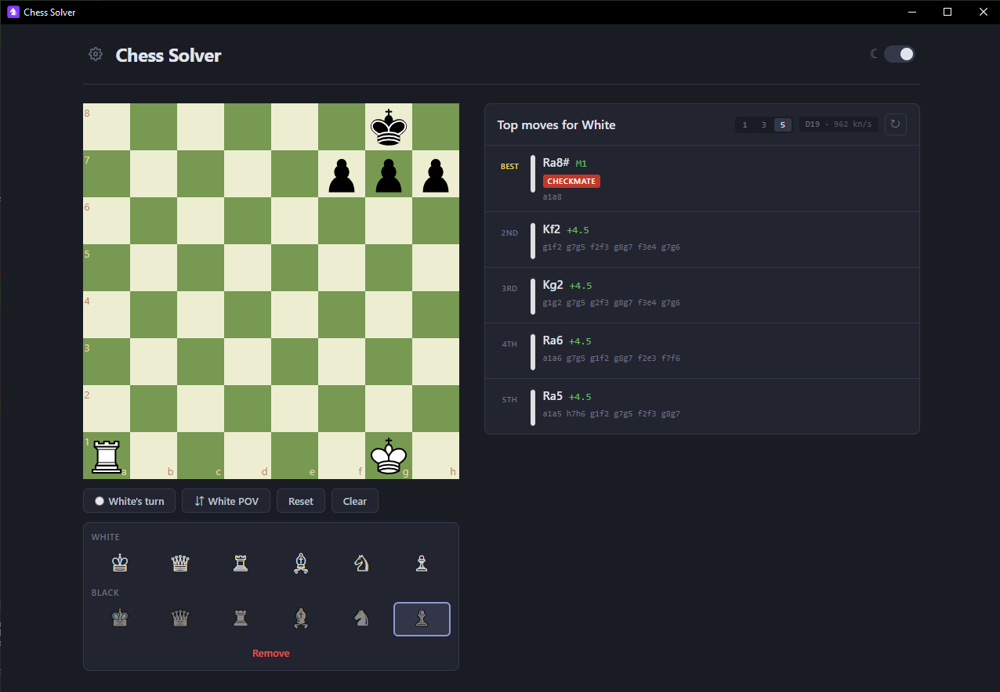
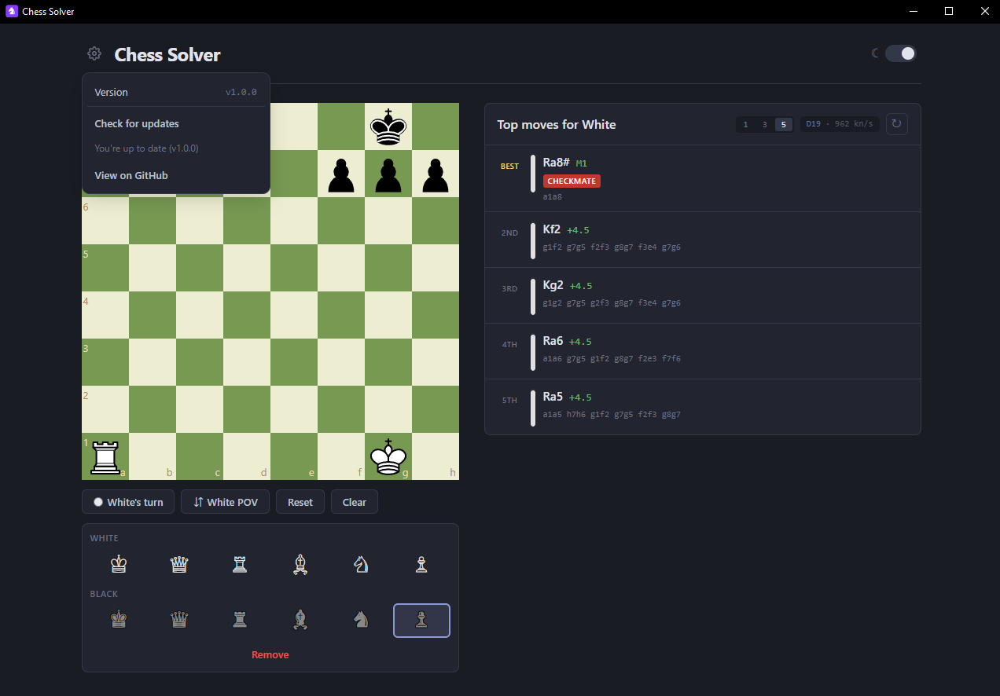

<p align="center">
  
</p>

<h1 align="center">Chess Solver</h1>

<p align="center">
  A desktop chess analysis tool powered by Stockfish 18.<br />
  Set up any board position and get the top engine-recommended moves with evaluations, tactical motifs, and principal variations.
</p>

<p align="center">
  <a href="https://github.com/ccharafeddine/chess-solver/actions/workflows/ci.yml"></a>
  <a href="https://github.com/ccharafeddine/chess-solver/releases/latest"></a>
  <a href="LICENSE"></a>
</p>

<p align="center">
  
  
  
  
  
</p>

<p align="center">
  
</p>

<table align="center">
  <tr>
    <td width="50%">
      
      <p align="center"><sub>Tactical motifs flagged on every line — here a back-rank mate in 1</sub></p>
    </td>
    <td width="50%">
      
      <p align="center"><sub>Built-in update check against GitHub releases</sub></p>
    </td>
  </tr>
</table>

## Features

- Drag-and-drop piece movement with click-to-place editing
- Paste a FEN to load a position, and copy the current FEN
- Import a PGN game (file or paste), step through it, and export the current game
- Move list with back, forward, start, and end
- Stockfish 18 analysis on all your CPU cores (multi-threaded NNUE build), streaming results so the best move so far appears within milliseconds of each move
- 1 / 3 / 5 candidate lines (fewer lines = deeper search), with eval bars and depth info
- Adjustable think time per position (1s / 3s / 5s / 10s)
- Tactical motif detection (forks, pins, skewers, checks, etc.)
- Opening name recognition
- Checkmate, stalemate, and draw detection
- Light/dark theme toggle
- Board flip and turn switching
- Update check against GitHub releases: automatic at startup (a banner appears when a new version is out) and on demand from Settings → Check for updates

## Quick Start (Development)

```bash
npm install
npm run dev
```

Opens the app in your browser at `http://localhost:5173`.

The Stockfish engine (`stockfish-18.js` + its ~113 MB `.wasm`) comes from the `stockfish` npm package: the dev server serves it straight from `node_modules`, and `npm run build` copies it into `dist/`. Nothing engine-related is committed to the repo.

## Testing

```bash
npm test        # unit tests (vitest)
npm run lint    # eslint
npm run build   # type-check + production build
```

The same three steps run in CI on every push and pull request.

## Download

Prebuilt binaries are on the [releases page](https://github.com/ccharafeddine/chess-solver/releases/latest):

- **Windows** — `Chess.Solver.Setup.<version>.exe`, a per-user installer (no administrator rights required). Run it and the app is added to the Start Menu with a desktop shortcut (SmartScreen may warn on first run because the binary is unsigned; choose "More info → Run anyway").
- **macOS** — `Chess.Solver-<version>-universal.dmg`, a universal (Intel + Apple Silicon) disk image. The app is not notarized, so on first launch right-click the app → **Open** → **Open** to get past Gatekeeper.

Release binaries are built by the [release workflow](.github/workflows/release.yml) on tagged commits.

## Build Standalone Desktop App

```bash
npm install
npm run electron
```

Builds the production bundle and launches it as a standalone Electron desktop app.

## Build Installers

```bash
npm run dist
```

Builds for the platform you run it on and outputs to `release/`:

- **On Windows:** `release/Chess Solver Setup <version>.exe` — per-user NSIS installer — plus `release/win-unpacked/`, the unpacked app folder it installs from
- **On macOS:** `release/Chess Solver-<version>-universal.dmg` — universal disk image for Intel and Apple Silicon

`.dmg` files can only be built on macOS; CI's release workflow uses a macOS runner for that.

### First-time build (Windows)

The first `npm run dist` on a machine downloads the `winCodeSign` toolchain, which contains symbolic links into a macOS subfolder. Windows blocks symlink creation unless one of these is true:

- The PowerShell session is running as **Administrator**, or
- **Developer Mode** is enabled in Settings → Privacy & Security → For developers

Run the first build under one of those conditions. Subsequent builds reuse the cached toolchain and do not need elevated privileges.

## Install as a Desktop App (Windows)

`npm run dist` produces the installer itself — run `release/Chess Solver Setup <version>.exe`.

It installs per user into `%LOCALAPPDATA%\Programs\Chess Solver` (no administrator
rights, no UAC prompt), creates desktop and Start Menu shortcuts, and registers an entry
under **Settings -> Apps** so it can be uninstalled normally. Re-running a newer
installer upgrades in place.

To pin to the taskbar, right-click the desktop shortcut -> **Pin to taskbar** (Windows
blocks programmatic taskbar pinning).

## App Icon

The app icon is a chess-knight glyph on a purple `#863bff` rounded square. Windows embeds `build/icon.ico`; macOS converts `build/icon.png` (1024×1024) to `.icns` at package time. To regenerate both after editing the design, run:

```powershell
powershell -ExecutionPolicy Bypass -File build/make-icon.ps1      # icon.ico (256..16)
powershell -ExecutionPolicy Bypass -File build/make-icon-png.ps1  # icon.png (1024)
```

Both scripts use GDI+ with no external dependencies. Rerun `npm run dist` afterwards to embed the result.

## How to Use

1. The board starts with the standard chess position. Stockfish begins analyzing automatically.
2. Select a piece from the palette below the board, then click any square to place it.
3. Use **Remove** to erase pieces from the board.
4. Toggle **White/Black to move** to change the side to analyze.
5. The analysis panel shows the top engine moves with evaluations, tactical motifs, and principal variations. Use the **1 / 3 / 5** selector to trade breadth for depth.
6. Click any analysis line to play that move on the board.
7. Hover over a line to highlight the move on the board.
8. Use **Reset** to restore the starting position or **Clear** to empty the board.
9. Paste a FEN into the field under the piece palette and press **Load**. **Copy** puts the current position on the clipboard. A FEN the board cannot represent shows an error and does not change the position.
10. **Import PGN** reads a `.pgn` file. **Paste PGN** does the same from text. The move list starts at the beginning of the game; use the arrows or click a move to step through it. **Export PGN** downloads the current game. Import keeps the main line.
11. Open the **⚙ settings menu** (top left) to change the engine's think time, see the app version, or check for updates. A dot on the gear and a banner under the header mean a new release is available.

## How it's built

Chess Solver is an Electron desktop app. The window loads the React UI from a small static server in the main process (`electron/main.cjs`), bound to `127.0.0.1`. Every response from that server sends `Cross-Origin-Opener-Policy: same-origin` and `Cross-Origin-Embedder-Policy: require-corp`. Browsers only expose `SharedArrayBuffer` on a cross-origin-isolated page, and the multi-threaded Stockfish build needs it to start its pthread workers. Electron's window does not reliably apply those headers (`crossOriginIsolated` stays false), so the main process also enables `SharedArrayBuffer` with a Chromium command-line switch before the app is ready. The dev server sends the same two headers.

The engine is the Stockfish 18 multi-threaded NNUE build from the `stockfish` npm package. It is not committed to the repo. In development, Vite serves `stockfish-18.js` and `stockfish-18.wasm` from `node_modules`. The production build copies them into `dist/` as `stockfish.js` and `stockfish.wasm`. The UI runs that script in a Web Worker (`src/engine/stockfish.ts`) and speaks UCI to it.

The board is React, drawn with react-chessboard. Legal play goes through chess.js, which keeps castling rights, en passant, and the move counters. The piece editor is allowed to build positions a real game cannot reach, including ones chess.js refuses to load. Those edits go through the raw FEN helpers in `src/engine/fen.ts`.

### Lost stops, and restarting a stuck search

Stockfish answers every `go` with exactly one `bestmove`. The worker queues a new `go` while the previous search is still unwinding, but it runs `stop` immediately. One `stop` can therefore arrive before the `go` it was meant to cancel, and that search continues with nothing waiting on it. The engine treats that as a lost stop: it sends `stop` again every 100ms until the matching `bestmove` arrives. If none arrives within 8 seconds, the worker is taken to be stuck, torn down, and started again. The position the user asked for is held in a pending slot and runs on the new worker, so a restart does not need a manual refresh. A second watchdog covers a `go` that never answers at all, and retries that search once before reporting failure. Rebuilding the worker recompiles the WASM binary (about 113 MB) and clears the hash table, so both timeouts wait longer than a healthy engine needs.

### Why the Windows download got smaller

The v1.1.1 portable `.exe` was a 304 MB download. electron-builder was packing every Stockfish build shipped in `node_modules` next to the single copy in `dist/` that the app actually loads. Excluding `node_modules` from the package, then switching Windows from a portable executable (it unpacked its whole payload on every launch) to a per-user NSIS installer, brought that download to about 165 MB. Those two figures are the ones recorded with that change.

## Limitations and roadmap

- Windows and macOS builds are unsigned and not notarized, so SmartScreen and Gatekeeper warn on first launch.
- The editor can produce positions a game cannot reach. Analysis still runs when the board has one king of each color and eight ranks of eight squares. Tactic labels are omitted when chess.js rejects the FEN, which is what a pawn on the first or eighth rank does.
- PGN import follows the main line. Variations, comments, and annotations are dropped, and export writes that main line back out.
- Opening names come from a table of common positions in the app, not a full opening book.
- There is no online play and no engine-versus-engine mode.

Still to do: code signing and notarization, and PGN variations and comments.

## Tech Stack

- React 19 + TypeScript
- Vite (dev server serves COOP/COEP headers so `SharedArrayBuffer` is available for the threaded Stockfish build)
- Stockfish 18 WASM (multi-threaded NNUE build, pthread workers), from the `stockfish` npm package
- chess.js for move validation
- react-chessboard for the board UI
- Electron for desktop runtime, electron-builder for packaging
- Vitest for unit tests, GitHub Actions for CI

## License and credits

Chess Solver is free software under the GNU General Public License, version 3 only. See [LICENSE](LICENSE).

The desktop app bundles Stockfish 18, which is itself under the GNU GPL version 3. An MIT license on this repository did not cover distributing that engine, so the project is GPL-3.0-only. [THIRD_PARTY_NOTICES](THIRD_PARTY_NOTICES) names the other components and their licenses.

The Stockfish developers write the engine: <https://github.com/official-stockfish/Stockfish>. The WebAssembly build comes from stockfish.js by Nathan Rugg (npm package `stockfish`): <https://github.com/nmrugg/stockfish.js>.

Packaged builds carry the GPL text, the third-party notices, and the `Copying.txt` from the stockfish package. They are placed in `resources/licenses/` beside the app, and again under `dist/licenses/` inside the app archive. The packager's `!node_modules/**/*` exclusion would otherwise omit the package's own license file; those copies are what replace it.

Source for this application: <https://github.com/ccharafeddine/chess-solver>
